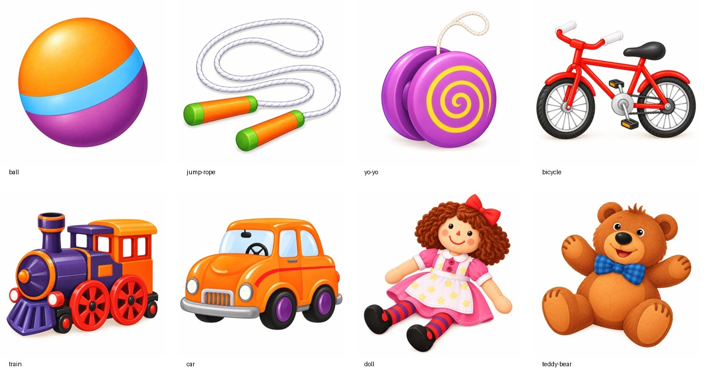

# Unit 1 – Bộ 8 hình đồ chơi cho câu hỏi

Bộ hình bổ sung cho lựa chọn đáp án: ball, jump rope, yo-yo, bicycle, train, car, doll, teddy bear. Tạo bằng công cụ **image_gen tích hợp**, dựa trên hai hình Words trong `../Unit_1_Toys_audio_mapping.zip`.

- `webp/`: 8 hình riêng, 512×512, nền trắng, không chữ hoặc nhãn đáp án.
- `originals/`: bản PNG 1024×1024 để tái xuất khi cần; đây là bản xuất chuẩn hóa từ kết quả tạo hình.
- `preview.jpg`: xem cả bộ hình; tên dưới mỗi ô chỉ có trong bản xem trước.
- `manifest.json`: tên đồ chơi, đường dẫn asset và các track bài học liên quan. Danh sách track không phải mapping mốc thời gian trong audio.
- `generation.json`: prompt đầy đủ cho từng hình, công cụ và nguồn kết quả tạo hình; đường dẫn nguồn trên máy chỉ phục vụ truy vết.
- `references/`: hai crop nguyên bản từ ZIP để đối chiếu.

## Dùng trong câu hỏi

Dùng các asset như hình lựa chọn đồ chơi sau khi nghe; giữ nguyên hình bài học gốc cho hội thoại, nhân vật, số thứ tự đồ vật và hoạt động hỏi tên. Khi chuyển câu hỏi đang dùng “hình số 2/3/4” sang bộ này, phải giữ nguyên thứ tự lựa chọn hoặc đổi lời hỏi thành “chọn đồ chơi”; mỗi asset riêng không có số thứ tự.

Bộ này chưa bao gồm hình đứng/ngồi, nhân vật chào hỏi hoặc alphabet. Chưa có source ứng dụng trong repo để tích hợp lên UI. Các file Markdown câu hỏi hiện có vẫn giữ nguyên.

Đã kiểm tra bằng mắt: đúng đối tượng, đặc điểm và màu chính, không có chữ/đáp án, không có đồ vật thừa. Đã chỉnh lại yo-yo để dây nằm trọn trong khung. Kiểm tra file: đủ 8 PNG 1024×1024 và 8 WebP 512×512.

